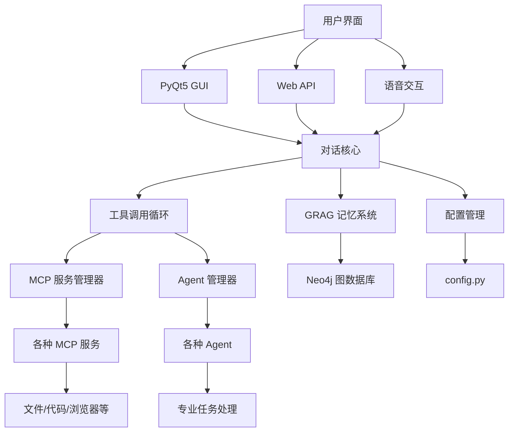

# NagaAgent 3.1


---

**🐍 智能对话助手 | 多平台支持 | 丰富生态 | 易于扩展**

[功能特性](#-核心功能) • [快速开始](#-快速开始) • [安装指南](#-详细安装指南) • [API文档](#-restful-api服务) • [配置说明](#-配置说明)

---

### 🎯 项目亮点

✅ **🧠 智能记忆**: 基于 Neo4j 的知识图谱记忆系统  
✅ **🔧 丰富生态**: 支持多种 MCP 服务和 Agent  
✅ **🎤 语音交互**: 流式语音合成和识别  
✅ **🖥️ 现代界面**: 美观的 PyQt5 图形界面  
✅ **🌐 完整 API**: RESTful API 和流式输出  
✅ **📱 系统托盘**: 后台运行和自启动支持  
✅ **🔍 智能代理**: 动态服务发现和管理  
✅ **🛡️ 安全可靠**: 会话隔离和权限管理  

---

## 🚀 快速开始

### 📋 系统要求

- **操作系统**: Windows 10/11, macOS 10.15+, Linux
- **Python**: 3.10+ (推荐 3.11)
- **内存**: 建议 4GB 以上
- **存储**: 建议 2GB 以上可用空间

### 🔧 一键安装

<details>
<summary><strong>Windows 用户</strong></summary>

```powershell
# 克隆项目
git clone https://github.com/Xxiii8322766509/NagaAgent.git
cd NagaAgent

# 一键配置
.\setup.ps1
```
</details>

<details>
<summary><strong>macOS 用户</strong></summary>

```bash
# 克隆项目
git clone https://github.com/Xxiii8322766509/NagaAgent.git
cd NagaAgent

# 一键配置
chmod +x setup_mac.sh
./setup_mac.sh
```
</details>

<details>
<summary><strong>Linux 用户</strong></summary>

```bash
# 克隆项目
git clone https://github.com/Xxiii8322766509/NagaAgent.git
cd NagaAgent

# 创建虚拟环境
python3 -m venv .venv
source .venv/bin/activate

# 安装依赖
pip install -r requirements.txt
```
</details>

### 🗄️ 启动 Neo4j 服务

```bash
# 启动 Neo4j 容器
docker run -d \
  --restart always \
  --publish=7474:7474 \
  --publish=7687:7687 \
  --env NEO4J_AUTH=neo4j/your_password \
  --volume=neo4j_data:/data \
  neo4j:latest
```

> **端口冲突解决**: 如果端口被占用，可以使用其他端口：
> ```bash
> --publish=8474:7474 --publish=8687:7687
> ```

### ⚙️ 配置文件

1. 复制配置模板：
   ```bash
   cp config.json.example config.json
   ```

2. 编辑配置文件，设置API密钥和其他参数

### 🚀 启动应用

<details>
<summary><strong>Windows 启动方式</strong></summary>

```powershell
# 普通模式
.\start.bat

# 托盘模式 (推荐)
.\start_with_tray.bat
```
</details>

<details>
<summary><strong>macOS 启动方式</strong></summary>

```bash
./start_mac.sh
```
</details>

<details>
<summary><strong>Linux 启动方式</strong></summary>

```bash
./start.sh
```
</details>

启动后将自动开启：
- 🖥️ PyQt5 图形界面
- 🌐 RESTful API 服务器
- 🎤 语音交互服务
- 🧠 GRAG 知识图谱记忆系统

---

## 🛠️ 详细安装指南

### 🔍 环境检查

安装完成后，运行环境检查：
```bash
python check_env.py
```

### 📦 依赖说明

项目依赖主要包括：

| 类别 | 依赖包 | 用途 |
|------|--------|------|
| **核心框架** | `openai`, `mcp`, `fastapi` | AI对话和API服务 |
| **GUI界面** | `PyQt5`, `pygame` | 图形用户界面 |
| **语音处理** | `edge-tts`, `pyaudio` | 语音合成和识别 |
| **知识图谱** | `py2neo`, `pyvis` | Neo4j图数据库操作 |
| **浏览器自动化** | `playwright` | 网页操作自动化 |
| **MCP工具** | `jmcomic`, `fastmcp` | 多种扩展工具 |

### ⚠️ 常见问题解决

<details>
<summary><strong>Windows 安装问题</strong></summary>

**C++ 编译工具缺失：**
```powershell
# 下载并安装 Microsoft Visual C++ Build Tools
# https://visualstudio.microsoft.com/visual-cpp-build-tools/
```

**Numpy 警告并且程序崩溃：**
```powershell
# 安装 Visual Studio 后，在 Developer Command Prompt 中执行
uv pip uninstall numpy
uv sync --no-cache --reinstall
```

**权限问题：**
```powershell
# 以管理员身份运行 PowerShell
Set-ExecutionPolicy RemoteSigned -Scope CurrentUser
```
</details>

<details>
<summary><strong>macOS 安装问题</strong></summary>

**Python 版本过低：**
```bash
brew install python@3.11
echo 'export PATH="/usr/local/opt/python@3.11/bin:$PATH"' >> ~/.zshrc
```

**PyAudio 安装失败：**
```bash
brew install portaudio
pip install pyaudio
```

**权限问题：**
```bash
chmod +x *.sh
```
</details>

<details>
<summary><strong>Linux 安装问题</strong></summary>

**系统依赖：**
```bash
# Ubuntu/Debian
sudo apt update
sudo apt install python3-dev portaudio19-dev

# CentOS/RHEL
sudo yum install python3-devel portaudio-devel
```

**Docker 权限：**
```bash
sudo usermod -aG docker $USER
newgrp docker
```
</details>

---

## ⚙️ 配置说明

### API 配置
修改 `config.json` 文件中的 `api` 部分：
```json
{
  "api": {
    "api_key": "your-api-key-here",
    "base_url": "https://api.deepseek.com/v1",
    "model": "deepseek-chat",
    "temperature": 0.7,
    "max_tokens": 2000,
    "max_history_rounds": 10
  }
}
```

### API服务器配置
```json
{
  "api_server": {
    "enabled": true,
    "host": "127.0.0.1",
    "port": 8000,
    "auto_start": true,
    "docs_enabled": true
  }
}
```

### GRAG知识图谱记忆系统配置
```json
{
  "grag": {
    "enabled": true,
    "auto_extract": true,
    "context_length": 5,
    "similarity_threshold": 0.6,
    "neo4j_uri": "neo4j://127.0.0.1:7687",
    "neo4j_user": "neo4j",
    "neo4j_password": "your_password",
    "neo4j_database": "neo4j"
  }
}
```

### 获取 API 密钥
1. 访问对应的LLM服务商官网（如DeepSeek、OpenAI等）
2. 注册账号并创建 API 密钥
3. 将密钥填入 `config.json` 文件的 `api.api_key` 字段

---

## 🌟 核心功能

### 🧠 智能对话系统
- **多模型支持**: 兼容 OpenAI、DeepSeek、Anthropic 等主流 LLM 提供商
- **上下文记忆**: 智能维护对话历史，支持多轮对话上下文
- **流式输出**: 实时显示 AI 回复，提升交互体验
- **工具调用**: 自动解析和执行 LLM 返回的工具调用指令

### 🔧 MCP 服务生态
- **动态服务发现**: 自动扫描和注册所有 MCP 服务
- **即插即用**: 新增服务无需重启系统
- **服务管理**: 统一的服务池查询和管理接口
- **多服务协作**: 支持多个 Agent 协同工作

### 🗺️ GRAG 知识图谱
- **五元组提取**: 自动从对话中提取实体-关系-属性
- **智能检索**: 基于相似度的上下文召回机制
- **可视化展示**: 支持知识图谱的可视化展示
- **历史导入**: 兼容旧版对话记录的批量导入

### 🎤 语音交互系统
- **流式合成**: 基于 Edge-TTS 的实时语音合成
- **智能分句**: 自动识别句子边界，优化播放体验
- **异步处理**: 文本显示和音频播放完全分离
- **多引擎支持**: 兼容多种 TTS 引擎

### 🖥️ 用户界面
- **现代化 GUI**: 基于 PyQt5 的精美图形界面
- **Markdown 支持**: 完整的 Markdown 语法支持
- **主题定制**: 支持界面主题、透明度等自定义
- **响应式设计**: 自适应不同屏幕尺寸

### 🌐 API 服务
- **RESTful API**: 完整的 HTTP API 接口
- **流式支持**: Server-Sent Events 流式输出
- **自动文档**: 交互式 API 文档 (Swagger)
- **跨域支持**: 完整的 CORS 配置

### 📱 系统托盘
- **后台运行**: 支持最小化到系统托盘
- **自动隐藏**: 启动后自动隐藏控制台窗口
- **快捷操作**: 托盘图标右键菜单
- **自启动**: 支持注册表方式的自启动功能

### 🔍 智能 Agent 系统
- **配置管理**: 统一的 Agent 配置和管理
- **会话隔离**: 多用户会话完全隔离
- **占位符替换**: 支持动态内容替换
- **生命周期管理**: 完整的 Agent 生命周期管理

---

## 🏗️ 技术架构

<div align="center">



</div>

### 📊 核心模块

| 模块 | 功能 | 技术栈 |
|------|------|--------|
| **对话核心** | 处理用户输入和AI响应 | Python, OpenAI API |
| **MCP 服务** | 工具调用和服务管理 | MCP Protocol |
| **Agent 系统** | 专业任务处理 | 多模型支持 |
| **记忆系统** | 知识图谱和上下文 | Neo4j, Py2neo |
| **用户界面** | 图形交互界面 | PyQt5, Markdown |
| **API 服务** | HTTP 接口服务 | FastAPI, Uvicorn |
| **语音系统** | 语音合成和识别 | Edge-TTS, PyAudio |

---

## 🗂️ 目录结构
```
NagaAgent3.0/
├── main.py                     # 主入口
├── config.py                   # 全局配置
├── conversation_core.py        # 对话核心（含工具调用循环主逻辑）
├── apiserver/                  # API服务器模块
│   ├── api_server.py           # FastAPI服务器
│   ├── start_server.py         # 启动脚本
│   └── README.md               # API文档
├── mcpserver/
│   ├── mcp_manager.py          # MCP服务管理
│   ├── mcp_registry.py         # Agent注册与schema元数据
│   ├── agent_manager.py        # Agent管理器（独立系统）
│   ├── agent_xxx/              # 各类自定义Agent
│   │   └── agent-manifest.json # Agent配置文件
├── agent_configs/              # Agent配置文件目录
│   └── *.json                  # Agent配置文件
├── requirements.txt             # 项目依赖
├── setup.ps1                   # Windows配置脚本
├── start.bat                   # Windows启动脚本
├── start_with_tray.bat         # Windows托盘启动脚本
├── setup_mac.sh                # Mac配置脚本
├── check_env.py                # 跨平台环境检查
├── summer_memory/              # GRAG知识图谱记忆系统
│   ├── memory_manager.py       # 记忆管理器
│   ├── quintuple_extractor.py  # 五元组提取器
│   ├── quintuple_graph.py      # Neo4j图谱操作
│   ├── quintuple_rag_query.py  # 记忆查询
│   └── quintuple_visualize_v2.py  # 图谱可视化
├── logs/                       # 日志（含历史txt对话）
├── voice/                      # 语音相关
│   ├── tts_handler.py          # TTS处理器
│   └── voice_integration.py    # 语音集成
├── ui/                         # 前端UI
│   ├── pyqt_chat_window.py     # PyQt聊天窗口
│   ├── response_utils.py       # 前端通用响应解析工具
│   └── tray/                   # 系统托盘模块
│       ├── console_tray.py     # 控制台托盘功能
│       ├── auto_start.py       # 自启动管理
│       └── README.md           # 托盘使用说明
└── README.md                   # 项目说明
```

---

## 🔧 工具调用循环机制

### 系统概述
NagaAgent支持两种类型的工具调用：
- **MCP服务调用**: 通过`agentType: mcp`调用MCP类型的Agent
- **Agent服务调用**: 通过`agentType: agent`调用Agent类型的Agent

### 工具调用格式

#### MCP服务调用格式
```json
{
  "agentType": "mcp",
  "service_name": "MCP服务名称",
  "tool_name": "工具名称",
  "参数名": "参数值"
}
```

#### Agent服务调用格式
```json
{
  "agentType": "agent",
  "agent_name": "Agent名称",
  "prompt": "任务内容"
}
```

### 工具调用流程
1. **LLM输出JSON格式**: LLM根据用户需求输出工具调用请求
2. **自动解析agentType**: 系统首先解析agentType字段，确定调用类型
3. **路由到对应管理器**: 
   - `mcp`类型 → 路由到MCPManager处理
   - `agent`类型 → 路由到AgentManager处理
4. **执行工具调用**: 调用对应的服务执行具体任务
5. **结果返回LLM**: 将工具执行结果返回给LLM
6. **循环处理**: 重复步骤2-5，直到LLM输出普通文本或无工具调用

### 配置参数
```python
# config.py中的工具调用循环配置
MAX_handoff_LOOP_STREAM = 5      # 流式模式最大工具调用循环次数
MAX_handoff_LOOP_NON_STREAM = 5  # 非流式模式最大工具调用循环次数
SHOW_handoff_OUTPUT = False      # 是否显示工具调用输出
```

---

## 🌐 多Agent与MCP服务

### 动态服务池查询功能

#### 核心查询方法
```python
from mcpserver.mcp_registry import (
    get_all_services_info,      # 获取所有服务信息
    get_service_info,           # 获取单个服务详情
    query_services_by_capability, # 按能力搜索服务
    get_service_statistics,     # 获取统计信息
    get_available_tools         # 获取服务工具列表
)
```

#### API端点
- `GET /mcp/services` - 获取所有服务列表和统计信息
- `GET /mcp/services/{service_name}` - 获取指定服务详情
- `GET /mcp/services/search/{capability}` - 按能力搜索服务
- `GET /mcp/services/{service_name}/tools` - 获取服务工具列表
- `GET /mcp/statistics` - 获取服务统计信息

### 典型用法示例
```python
# 读取文件内容
await s.mcp.handoff(
  service_name="file",
  task={"action": "read", "path": "test.txt"}
)

# 运行Python代码
await s.mcp.handoff(
  service_name="coder",
  task={"action": "run", "file": "main.py"}
)
```

---

## 🤖 AgentManager 独立系统

### 系统概述
AgentManager是一个独立的Agent注册和调用系统，支持从配置文件动态加载Agent定义，提供统一的调用接口和完整的生命周期管理。

### 核心功能

#### 1. 配置管理
- **动态配置加载**: 从`agent_configs/`目录自动扫描和加载Agent配置文件
- **配置验证**: 自动验证Agent配置的完整性和有效性
- **热重载**: 支持运行时重新加载配置，无需重启系统
- **环境变量支持**: 支持从环境变量和`.env`文件加载敏感配置

#### 2. 会话管理
- **多会话支持**: 每个Agent支持多个独立的会话上下文
- **历史记录**: 自动维护对话历史，支持上下文召回
- **会话过期**: 自动清理过期的会话数据，节省内存
- **会话隔离**: 不同用户和不同Agent的会话完全隔离

#### 3. 智能占位符替换
支持多种类型的占位符替换：

**Agent配置占位符**:
- `{{AgentName}}` - Agent名称
- `{{Description}}` - 描述信息
- `{{ModelId}}` - 模型ID
- `{{Temperature}}` - 温度参数
- `{{MaxTokens}}` - 最大输出token数
- `{{ModelProvider}}` - 模型提供商

**环境变量占位符**:
- `{{ENV_VAR_NAME}}` - 系统环境变量

**时间占位符**:
- `{{CurrentTime}}` - 当前时间 (HH:MM:SS)
- `{{CurrentDate}}` - 当前日期 (YYYY-MM-DD)
- `{{CurrentDateTime}}` - 完整时间 (YYYY-MM-DD HH:MM:SS)

### 配置文件格式

#### Agent配置文件示例
```json
{
  "ExampleAgent": {
    "model_id": "deepseek-chat",
    "name": "示例助手",
    "base_name": "ExampleAgent",
    "system_prompt": "你是{{AgentName}}，一个专业的{{Description}}。\n\n当前时间：{{CurrentDateTime}}\n模型：{{ModelId}}\n温度：{{Temperature}}\n\n请用中文回答，保持专业和友好的态度。",
    "max_output_tokens": 8192,
    "temperature": 0.7,
    "description": "智能助手，擅长回答各种问题",
    "model_provider": "openai",
    "api_base_url": "https://api.deepseek.com/v1",
    "api_key": "{{DEEPSEEK_API_KEY}}"
  }
}
```

### 使用示例

#### 基本调用
```python
from mcpserver.agent_manager import get_agent_manager

# 获取AgentManager实例
agent_manager = get_agent_manager()

# 调用Agent
result = await agent_manager.call_agent(
    agent_name="ExampleAgent",
    prompt="请帮我分析这份数据",
    session_id="user_123"
)
```

#### 便捷函数调用
```python
from mcpserver.agent_manager import call_agent, list_agents, get_agent_info

# 便捷调用
result = await call_agent("ExampleAgent", "你好")

# 获取Agent列表
agents = list_agents()
```

---

## 📋 Agent Manifest标准化

### 标准化规范
所有Agent必须使用标准化的`agent-manifest.json`配置文件，确保一致性和可维护性。

#### 必需字段
- `name`: Agent唯一标识符
- `displayName`: 显示名称
- `version`: 版本号（x.y.z格式）
- `description`: 功能描述
- `author`: 作者或模块名称
- `agentType`: Agent类型（mcp/agent）
- `entryPoint`: 入口点配置（module和class）

### 创建新Agent

#### 创建MCP类型Agent
1. 在`mcpserver/`目录下创建新的Agent目录
2. 复制`AGENT_MANIFEST_TEMPLATE.json`到Agent目录
3. 修改manifest文件内容
4. 创建Agent实现类
5. 重启系统自动注册

#### 创建Agent类型Agent
1. 在`agent_configs/`目录下创建配置文件
2. 定义Agent配置（模型、提示词等）
3. 配置环境变量（API密钥等）
4. 重启系统自动加载

---

## 🖥️ 系统托盘功能

### 功能特性
- **控制台托盘**: 将终端窗口隐藏到系统托盘，支持自动隐藏
- **任务栏隐藏**: 控制台窗口从任务栏完全隐藏
- **托盘图标**: 系统托盘显示应用图标，支持右键菜单
- **自启动管理**: 支持注册表方式的自启动功能
- **托盘消息**: 支持状态通知和消息提示

### 使用方法

#### 托盘模式启动
```bash
# Windows
.\start_with_tray.bat
```

#### 托盘菜单功能
- **显示控制台**: 从托盘恢复控制台窗口显示
- **隐藏控制台**: 隐藏控制台窗口到托盘
- **开机自启动**: 切换自启动状态
- **退出**: 完全退出应用

### 技术实现
- **窗口钩子**: 监听控制台窗口的关闭事件，拦截关闭操作
- **窗口样式**: 使用`WS_EX_TOOLWINDOW`样式让窗口不在任务栏显示
- **自动隐藏**: 启动后3秒自动隐藏控制台窗口
- **托盘集成**: 使用PyQt5实现系统托盘功能

### 注意事项
1. **权限要求**: 自启动功能需要管理员权限
2. **依赖安装**: 需要安装`PyQt5`库
3. **图标文件**: 默认使用`ui/window_icon.png`作为托盘图标
4. **启动方式**: 使用`start_with_tray.bat`启动以启用托盘功能

---

## 🌐 RESTful API 服务

NagaAgent内置完整的RESTful API服务器，启动时自动开启，支持所有对话功能：

### API接口说明

- **基础地址**: `http://127.0.0.1:8000` (可在config.py中配置)
- **交互式文档**: `http://127.0.0.1:8000/docs`
- **OpenAPI规范**: `http://127.0.0.1:8000/openapi.json`

### 主要接口

#### 健康检查
```bash
GET /health
```

#### 对话接口
```bash
# 普通对话
POST /chat
{
  "message": "你好，娜迦",
  "session_id": "optional-session-id"
}

# 流式对话 (Server-Sent Events)
POST /chat/stream
{
  "message": "请介绍一下人工智能的发展历程"
}
```

#### 系统管理接口
```bash
# 获取系统信息
GET /system/info

# 切换开发者模式
POST /system/devmode

# 获取记忆统计
GET /memory/stats
```

## MCP服务Agent化升级说明

- 所有MCP服务（如文件、代码、浏览器、应用启动、系统控制、天气等）已全部升级为标准Agent风格：
  - 统一继承自`agents.Agent`，具备`name`、`instructions`属性和`handle_handoff`异步方法
  - 变量全部走`config.py`统一管理，避免重复定义
  - 注释全部中文，文件/类/函数注释一行，变量注释右侧#
  - 支持多agent协作，ControllerAgent可智能分配任务给BrowserAgent、ContentAgent等
  - 注册中心`mcp_registry.py`自动发现并注册所有实现了`handle_handoff`的Agent实例，支持热插拔
  - 注册时自动输出所有已注册agent的名称和说明，便于调试
  - 简化Agent类型：只支持`mcp`和`agent`两种类型

- handoff机制全部通过`handle_handoff`异步方法调度，兼容JSON和handoff两种格式

- 新增/删除agent只需增删py文件，无需重启主程序

- 详细接口和参数请参考各Agent代码注释与`config.py`配置 

## 更新日志

- 工具调用格式已优化，改为纯JSON格式，更加简洁规范，具体示例如下：

```
{
  "agentType": "mcp",
  "service_name": "MCP服务名称",
  "tool_name": "工具名称",
  "参数名": "参数值"
}
```

---

## 📝 前端UI与响应适配
- **所有后端返回均为结构化JSON**: 前端通过`ui/response_utils.py`的`extract_message`方法自动适配多种返回格式
- **优先显示逻辑**: 优先显示`data.content`，其次`message`，最后原样返回，兼容所有Agent
- **换行符自动适配**: PyQt前端自动将所有`\n`和`\\n`换行符转为`<br>`，多行内容显示无障碍
- **UI动画**: 侧栏点击切换时，侧栏宽度、主聊天区宽度、输入框高度均采用同步动画
- **主题自定义**: UI动画、主题、昵称、透明度等全部可在`config.py`和`pyqt_chat_window.py`灵活配置

---

## 🔊 流式语音交互
- **支持语音输入**: 流式识别，自动转文字
- **支持语音输出**: 流式合成，边播边出
- **完全异步处理**: 重构语音集成系统，文本显示和音频播放完全分离
- **消除重复播放**: 移除流式分句和最终文本的重复播放问题
- **前端即时显示**: 前端立即显示文本，不再等待音频处理完成
- **依赖与配置**: 详见`voice/voice_config.py`和README相关章节

---

## 📝 其它亮点
- **记忆权重动态调整**: 支持AI/人工标记important，权重/阈值/清理策略全部在`config.py`统一管理
- **主题归类自动化**: 主题归类、召回、权重提升、清理等全部自动化
- **检索日志自动记录**: 参数可调，GRAG配置示例见`config.py`
- **历史对话兼容升级**: 支持将旧版txt对话内容一键导入GRAG知识图谱记忆系统
- **工具调用循环自动执行机制**: 支持多轮递归调用，最大循环次数可配置
- **所有Agent的注册元数据已集中在`mcpserver/mcp_registry.py`**: 主流程和管理器极简，扩展维护更方便
- **自动注册/热插拔Agent机制**: 新增/删除Agent只需增删py文件，无需重启主程序
- **Agent Manifest标准化**: 统一的`agent-manifest.json`格式，支持完整的字段验证和类型检查
- **动态服务池查询**: 系统通过扫描`agent-manifest.json`文件自动发现和注册服务，无需手动配置静态服务列表
- **AgentManager独立系统**: 支持Agent的配置加载、会话管理、消息组装和LLM调用，提供完整的Agent生命周期管理
- **智能占位符替换**: 支持Agent配置、环境变量、时间信息等多种占位符，实现动态提示词生成
- **完整消息序列构建**: 自动组装系统消息、历史消息和用户消息，确保对话上下文完整性
- **多模型提供商支持**: 支持OpenAI、DeepSeek、Anthropic等多种LLM提供商，每个Agent可独立配置
- **会话隔离与TTL管理**: 支持多用户多会话隔离，自动清理过期会话数据
- **统一工具调用接口**: MCP和Agent类型服务通过统一的JSON格式调用，支持混合调用场景

---

## 🆙 历史对话兼容升级
- **支持将旧版txt对话内容一键导入GRAG知识图谱记忆系统**: 兼容主题、分层、五元组等所有新特性
- **激活指令**:
  ```
  #夏园系统兼容升级
  ```
- **系统会自动遍历logs目录下所有txt日志**: 列出所有历史对话内容并编号，输出到终端和`summer_memory/history_dialogs.json`
- **用户可查看编号后，选择导入方式**:
  - 全部导入：
    ```
    python summer_memory/main.py import all
    ```
  - 选择性导入（如第1、3、5-8条）：
    ```
    python summer_memory/main.py import 1,3,5-8
    ```
- **兼容过程自动判重**: 已入库内容不会重复导入，支持断点续跑
- **兼容内容全部走AI自动主题归类与分层**: 完全与新系统一致
- **详细进度、结果和异常均有反馈**: 安全高效

---

## 🔧 最新更新 (v3.0.5)

### 系统托盘功能增强
- **控制台托盘功能**: 实现真正的"最小化到托盘"功能
- **窗口钩子**: 监听控制台窗口的关闭事件，拦截关闭操作
- **任务栏隐藏**: 使用`WS_EX_TOOLWINDOW`样式让窗口不在任务栏显示
- **自动隐藏**: 启动后3秒自动隐藏控制台窗口
- **托盘消息**: 支持托盘消息通知和状态提示

### MCP工具依赖
- **新增依赖**: 添加`jmcomic`和`fastmcp`依赖到`requirements.txt`
- **虚拟环境安装**: 确保依赖安装到虚拟环境中
- **依赖验证**: 提供依赖安装验证脚本

### 技术改进
- **窗口监控**: 添加窗口状态监控线程，实时检测窗口显示/隐藏状态
- **样式管理**: 保存和恢复原始窗口样式，确保功能稳定性
- **错误处理**: 增强窗口操作和托盘功能的错误处理机制

---

## ❓ 常见问题

### 环境检查
```bash
python check_env.py
```
### Windows 环境
- **Python版本/依赖/虚拟环境/浏览器驱动等问题**: 详见`setup.ps1`与本README
- **IDE报import错误**: 重启并选择正确解释器
- **语音依赖安装失败**: 先装C++ Build Tools
- **MCP工具依赖缺失**: 运行`pip install jmcomic fastmcp`

### Mac 环境
- **Python版本过低**: `brew install python@3.11`
- **PyAudio安装失败**: `brew install portaudio && pip install pyaudio`
- **权限问题**: `chmod +x *.sh`

### API服务器问题
- **端口占用**: 修改`config.py`中的`API_SERVER_PORT`
- **代理干扰**: 临时禁用代理 `unset ALL_PROXY http_proxy https_proxy`
- **依赖缺失**: 确保安装了FastAPI和Uvicorn `pip install fastapi uvicorn[standard]`
- **无法访问**: 检查防火墙设置，确保端口未被阻塞

### 工具调用问题
- **工具调用循环次数过多**: 调整`config.py`中的`MAX_handoff_LOOP_STREAM`和`MAX_handoff_LOOP_NON_STREAM`
- **工具调用失败**: 检查MCP服务是否正常运行，查看日志输出
- **格式错误**: 确保LLM输出严格遵循JSON格式

### GRAG记忆系统问题
- **Neo4j连接失败**: 检查Neo4j服务是否启动，确认连接参数正确
- **记忆查询无结果**: 检查五元组是否正确提取和存储
- **性能问题**: 调整`config.py`中的GRAG相关参数

### 系统托盘问题
- **托盘图标不显示**: 检查图标文件是否存在，确认PyQt5安装正确
- **控制台托盘不工作**: 确认使用`start_with_tray.bat`启动
- **自启动失败**: 确认管理员权限，检查注册表权限
- **窗口最小化问题**: 检查托盘集成是否正确，确认事件处理函数

### AgentManager问题
- **Agent配置加载失败**: 检查`agent_configs/`目录下的JSON文件格式是否正确
- **API调用失败**: 确认API密钥配置正确，检查网络连接
- **会话历史丢失**: 检查会话TTL配置，确认会话未过期
- **占位符替换失败**: 确认环境变量已正确设置
- **内存占用过高**: 调整`max_history_rounds`参数，减少历史消息数量

### 通用问题
- **浏览器无法启动**: 检查playwright安装与网络
- **主题树/索引/参数/密钥全部在`config.py`统一管理**
- **聊天输入`#devmode`进入开发者模式**: 后续对话不写入GRAG记忆，仅用于工具调用测试

### 最佳实践

#### Agent配置最佳实践
1. **使用环境变量**: 敏感信息如API密钥应使用环境变量
2. **合理设置参数**: 根据任务需求调整temperature和max_output_tokens
3. **优化提示词**: 使用占位符实现动态内容，提高灵活性
4. **会话管理**: 合理设置会话TTL，避免内存泄漏

#### 性能优化建议
1. **缓存配置**: 启用配置缓存，减少文件读取开销
2. **并发控制**: 合理控制并发Agent调用数量
3. **资源清理**: 定期清理过期会话和临时数据
4. **监控日志**: 启用调试模式监控系统性能

#### 安全建议
1. **API密钥管理**: 使用环境变量或密钥管理服务
2. **输入验证**: 对用户输入进行验证和清理
3. **错误处理**: 避免在错误信息中泄露敏感信息
4. **访问控制**: 实现适当的访问控制机制

---

## 🤝 贡献指南

我们欢迎所有形式的贡献！请阅读以下指南：

### 📋 贡献方式
- **报告问题**: 使用 GitHub Issues 提交 Bug 报告
- **功能建议**: 提出新功能的需求和建议
- **代码贡献**: 提交 Pull Request 改进代码
- **文档改进**: 完善项目文档和使用说明

### 📝 开发规范
- 遵循 PEP 8 代码风格
- 添加适当的注释和文档
- 确保代码测试通过
- 更新相关文档

### 📞 联系方式
- **Issues**: [GitHub Issues](https://github.com/Xxiii8322766509/NagaAgent/issues)
- **讨论**: [GitHub Discussions](https://github.com/Xxiii8322766509/NagaAgent/discussions)

---


## 🙏 致谢

感谢以下开源项目和贡献者：

- **[OpenAI](https://openai.com/)** - 提供强大的 AI 模型
- **[Neo4j](https://neo4j.com/)** - 图数据库支持
- **[PyQt5](https://riverbankcomputing.com/software/pyqt/)** - GUI 框架
- **[FastAPI](https://fastapi.tiangolo.com/)** - 现代 Web 框架
- **[MCP](https://modelcontextprotocol.io/)** - 模型上下文协议
- 所有贡献者和社区成员

---

## 📄 许可证

本项目采用 MIT 许可证 - 详见 [LICENSE](LICENSE) 文件

<div align="center">

---

**⭐ 如果这个项目对您有帮助，请考虑给我们一个 Star！**

</div>