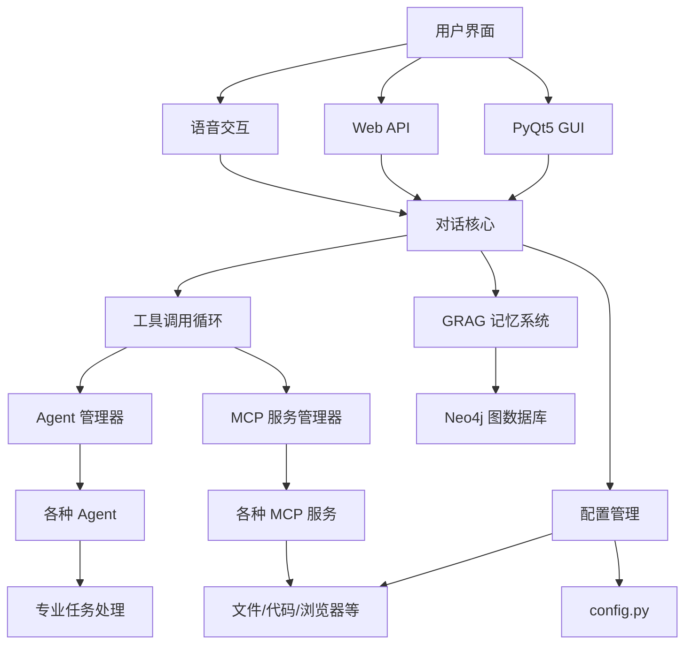

# NagaAgent 4.0


---

快速入门视频：[https://www.pylindex.top/naga/intro.mp4](https://www.pylindex.top/naga/intro.mp4)
---

**🐍 智能对话助手 | 多平台支持 | 丰富生态 | 易于扩展**

[功能特性](#-核心功能) • [快速开始](#-快速开始) • [安装指南](#-详细安装指南) • [API文档](#-restful-api服务) • [配置说明](#-配置说明)

---

### 🎯 项目亮点

✅ **🧠 智能记忆**: 基于 Neo4j 的 GRAG 知识图谱记忆系统  
✅ **🔧 丰富生态**: 支持多种 MCP 服务和 Agent 系统  
✅ **🎤 语音交互**: OpenAI 兼容的流式语音合成服务  
✅ **🖥️ 现代界面**: 基于 PyQt5 的独立对话框消息渲染系统  
✅ **🎭 Live2D集成**: 独立的Live2D模块，支持模型和图片的混合侧栏显示  
✅ **🌐 完整 API**: FastAPI RESTful API 和流式输出  
✅ **📱 系统托盘**: 完整的后台运行和自启动支持  
✅ **🔍 智能代理**: 动态服务发现和热插拔管理  
✅ **🛡️ 安全可靠**: 会话隔离和权限管理  
✅ **🤖 多Agent协作**: AgentManager 独立系统支持多Agent协作  
✅ **🌳 深度思考**: 基于遗传算法的多分支思考引擎  
✅ **🔄 配置热更新**: 实时配置变更，无需重启应用  
✅ **💾 持久化上下文**: 重启后自动恢复历史对话上下文  
✅ **🔧 系统检测**: 内置完整的系统环境检测和依赖验证功能  

---

## 🚀 快速开始

### 📋 系统要求

- **操作系统**: Windows 10/11, macOS 10.15+, Linux
- **Python**: 3.11
- **内存**: 建议 4GB 以上
- **存储**: 建议 2GB 以上可用空间

### 🔧 一键安装

#### 📦 依赖管理工具

NagaAgent 4.0 提供了强大的依赖管理工具，支持：

- **🔍 自动扫描**: 扫描项目所有依赖文件，包括主依赖和各子模块依赖
- **📊 依赖分析**: 按类别组织依赖（核心、GUI、语音、AI、网络、系统控制等）
- **✅ 状态检测**: 自动检测已安装和缺失的依赖
- **🛠️ 一键安装**: 生成PowerShell安装脚本和合并的requirements文件
- **⚠️ 冲突检测**: 检测依赖版本冲突和兼容性问题

**使用方法：**
```bash
# 运行依赖管理工具
python dependency_manager.py

# 查看依赖状态
python dependency_manager.py --check

# 生成安装脚本
python dependency_manager.py --generate-script

# 验证依赖安装
python dependency_manager.py --validate
```

**生成的文件：**
- `install_dependencies.ps1` - PowerShell一键安装脚本
- `requirements_merged.txt` - 合并的依赖文件
- `requirements_clean.txt` - 清理后的依赖文件

<details>
<summary><strong>Windows 用户</strong></summary>

```powershell
# 克隆项目
git clone https://github.com/Xxiii8322766509/NagaAgent.git
cd NagaAgent

# 使用依赖管理工具
python dependency_manager.py

# 或使用一键配置
.\setup.ps1
```
</details>

<details>
<summary><strong>macOS 用户</strong></summary>

```bash
# 克隆项目
git clone https://github.com/Xxiii8322766509/NagaAgent.git
cd NagaAgent

# 一键配置
chmod +x setup_mac.sh
./setup_mac.sh
```
</details>

<details>
<summary><strong>Linux 用户</strong></summary>

```bash
# 克隆项目
git clone https://github.com/Xxiii8322766509/NagaAgent.git
cd NagaAgent

# 创建虚拟环境
python3 -m venv .venv
source .venv/bin/activate

# 安装依赖
pip install -r requirements.txt
```
</details>

### 🗄️ 启动 Neo4j 服务

```bash
# 启动 Neo4j 容器
docker run -d \
  --restart always \
  --publish=7474:7474 \
  --publish=7687:7687 \
  --env NEO4J_AUTH=neo4j/your_password \
  --volume=neo4j_data:/data \
  neo4j:latest
```

> **端口冲突解决**: 如果端口被占用，可以使用其他端口：
> ```bash
> --publish=8474:7474 --publish=8687:7687
> ```

### ⚙️ 配置文件

1. 复制配置模板：
   ```bash
   cp config.json.example config.json
   ```

2. 编辑配置文件，设置API密钥和其他参数

### 🚀 启动应用

<details>
<summary><strong>Windows 启动方式</strong></summary>

```powershell
# 托盘模式
.\start_with_tray.bat
```
</details>

<details>
<summary><strong>macOS 启动方式</strong></summary>

```bash
./start_mac.sh
```
</details>

<details>
<summary><strong>Linux 启动方式</strong></summary>

```bash
./start.sh
```
</details>

启动后将自动开启：
- 🖥️ PyQt5 图形界面
- 🌐 RESTful API 服务器
- 🎤 语音交互服务
- 🧠 GRAG 知识图谱记忆系统
- 🔄 配置热更新系统

---

## 📁 项目结构

NagaAgent 4.0采用模块化架构设计，各功能模块独立且可扩展：

```
NagaAgent/
├── 📁 apiserver/              # API服务器模块
│   ├── api_server.py          # FastAPI服务器
│   ├── streaming_tool_extractor.py  # 流式工具调用提取器
│   └── tool_call_utils.py     # 工具调用工具类
├── 📁 system/                 # 系统核心模块
│   ├── system_checker.py      # 系统环境检测器
│   ├── config_manager.py      # 配置管理器
│   └── (已迁移到apiserver)   # 对话核心引擎
├── 📁 ui/                     # 用户界面模块
│   ├── live2d/                # Live2D集成模块
│   │   ├── renderer.py        # Live2D渲染器
│   │   ├── animator.py        # 动画系统
│   │   └── widget.py          # Live2D组件
│   ├── live2d_side_widget.py  # Live2D侧栏容器
│   ├── pyqt_chat_window.py    # 主聊天窗口
│   └── message_renderer.py    # 消息渲染器
├── 📁 voice/                  # 语音处理模块
│   ├── input/                 # 语音输入服务
│   │   ├── server.py          # ASR服务器
│   │   ├── vad_worker.py      # VAD端点检测
│   │   └── asr_client.py      # ASR客户端
│   └── output/                # 语音输出服务
│       ├── tts_handler.py     # TTS处理器
│       └── voice_integration.py # 语音集成
├── 📁 mcpserver/              # MCP服务模块
│   ├── agent_manager.py       # Agent管理器
│   ├── agent_*/               # 各种Agent服务
│   └── mcp_manager.py         # MCP管理器
├── 📁 thinking/               # 思考引擎模块
│   ├── tree_thinking.py       # 树形思考引擎
│   ├── genetic_pruning.py     # 遗传算法剪枝
│   └── thinking_node.py       # 思考节点
├── 📁 summer_memory/          # 记忆系统模块
│   ├── memory_manager.py      # 记忆管理器
│   ├── quintuple_extractor.py # 五元组提取器
│   └── graph.py               # 图数据库操作
├── 📁 logs/                   # 日志和存储
│   └── knowledge_graph/       # 知识图谱数据
├── 📁 system/prompts/         # 提示词存储（已迁移到system目录，管理功能集成到config.py）
├── 📁 mqtt_tool/              # MQTT通信工具
├── 📁 ui/tray/                # 系统托盘模块
└── 📄 main.py                 # 主程序入口
```

**核心模块说明：**
- **system/**: 系统核心功能，包括环境检测、配置管理、对话引擎
- **ui/**: 用户界面，支持Live2D、PyQt5、系统托盘等
- **voice/**: 语音处理，分离输入/输出，支持ASR和TTS
- **mcpserver/**: MCP服务生态，支持多种Agent和工具
- **thinking/**: 智能思考引擎，支持多分支推理
- **summer_memory/**: 知识图谱记忆系统，基于Neo4j

---

## 🛠️ 详细安装指南

### 📦 依赖整合说明

NagaAgent 4.0 已将核心依赖和API服务器相关依赖整合到 `nagaagent-core` 包中，以减少依赖下载负担：

**已整合的依赖包：**
- **核心依赖**: `mcp`, `openai`, `python-dotenv`, `requests`, `aiohttp`
- **API服务器依赖**: `flask`, `gevent`, `fastapi`, `uvicorn`

**安装方式：**
```bash
# 自动安装 nagaagent-core 包（包含所有核心依赖）
pip install -r requirements.txt
```

**优势：**
- ✅ 减少依赖下载时间
- ✅ 统一版本管理
- ✅ 简化安装流程
- ✅ 提高稳定性

### 🔍 系统环境检测

NagaAgent 4.0 内置了完整的系统环境检测功能，自动检测Python版本、虚拟环境、依赖包等：

```bash
# 运行系统环境检测
python -c "from system.system_checker import SystemChecker; SystemChecker().check_all()"

# 或者通过主程序自动检测
python main.py --check-env
```

**检测项目包括：**
- ✅ Python版本兼容性检查
- ✅ 虚拟环境状态检测
- ✅ 核心依赖包完整性验证
- ✅ 可选依赖包可用性检查
- ✅ 配置文件格式验证
- ✅ 目录结构完整性检查
- ✅ 文件权限和访问性测试
- ✅ 系统资源使用情况监控

### 📦 依赖说明

项目依赖主要包括：

| 类别 | 依赖包 | 用途 |
|------|--------|------|
| **核心框架** | `openai`, `mcp`, `fastapi` | AI对话和API服务 |
| **搜索工具** | `langchain-community` | SearXNG搜索集成 |
| **GUI界面** | `PyQt5`, `pygame` | 图形用户界面 |
| **语音处理** | `edge-tts`, `pyaudio`, `sounddevice` | 语音合成和识别 |
| **知识图谱** | `py2neo`, `pyvis`, `matplotlib` | Neo4j图数据库操作 |
| **浏览器自动化** | `playwright` | 网页操作自动化 |
| **MCP工具** | `jmcomic`, `fastmcp` | 多种扩展工具 |
| **系统控制** | `pycaw`, `screen-brightness-control` | 系统功能控制 |
| **通信协议** | `paho-mqtt`, `websockets` | MQTT和WebSocket通信 |
| **数据处理** | `numpy`, `pandas`, `scikit-learn` | 数据处理和机器学习 |
| **文档处理** | `python-docx` | Word文档处理 |

### ⚠️ 常见问题解决

<details>
<summary><strong>Windows 安装问题</strong></summary>

**C++ 编译工具缺失：**
```powershell
# 下载并安装 Microsoft Visual C++ Build Tools
# https://visualstudio.microsoft.com/visual-cpp-build-tools/
```

**Numpy 警告并且程序崩溃：**
```powershell
# 安装 Visual Studio 后，在 Developer Command Prompt 中执行
uv pip uninstall numpy
uv sync --no-cache --reinstall
```

**权限问题：**
```powershell
# 以管理员身份运行 PowerShell
Set-ExecutionPolicy RemoteSigned -Scope CurrentUser
```
</details>

<details>
<summary><strong>macOS 安装问题</strong></summary>

**Python 版本过低：**
```bash
brew install python@3.11
echo 'export PATH="/usr/local/opt/python@3.11/bin:$PATH"' >> ~/.zshrc
```

**PyAudio 安装失败：**
```bash
brew install portaudio
pip install pyaudio
```

**权限问题：**
```bash
chmod +x *.sh
```
</details>

<details>
<summary><strong>Linux 安装问题</strong></summary>

**系统依赖：**
```bash
# Ubuntu/Debian
sudo apt update
sudo apt install python3-dev portaudio19-dev

# CentOS/RHEL
sudo yum install python3-devel portaudio-devel
```

**Docker 权限：**
```bash
sudo usermod -aG docker $USER
newgrp docker
```
</details>

---

## ⚙️ 配置说明

### 🔄 配置热更新系统

NagaAgent 4.0 引入了强大的配置热更新系统，支持实时配置变更而无需重启应用。

#### 核心特性
- **实时更新**: 配置变更立即生效，无需重启
- **配置快照**: 支持配置的保存和恢复
- **自动监视**: 自动检测配置文件变化
- **模块重载**: 支持动态模块重新加载
- **错误处理**: 完善的异常处理机制

#### 使用方法

```python
from config_manager import update_config, get_config_snapshot

# 更新配置
success = update_config({
    "system": {"debug": True},
    "api": {"temperature": 0.8}
})

# 获取配置快照
snapshot = get_config_snapshot()

# 恢复配置
restore_config_snapshot(snapshot)
```

#### 详细文档
- 📖 [配置热更新使用指南](CONFIG_HOT_RELOAD_GUIDE.md)
- 📊 [配置热更新测试报告](CONFIG_HOT_RELOAD_TEST_REPORT.md)

### API 配置
修改 `config.json` 文件中的 `api` 部分：
```json
{
  "api": {
    "api_key": "your-api-key-here",
    "base_url": "https://api.deepseek.com/v1",
    "model": "deepseek-chat",
    "temperature": 0.7,
    "max_tokens": 10000,
    "max_history_rounds": 10,
    "persistent_context": true,
    "context_load_days": 3,
    "context_parse_logs": true
  }
}
```

#### 持久化上下文配置说明
- **persistent_context**: 是否启用持久化上下文功能（默认：true）
- **context_load_days**: 从最近几天的日志文件中加载历史对话（默认：3天）
- **context_parse_logs**: 是否从日志文件解析上下文（默认：true）

**前端历史记录显示**: 启用持久化上下文后，重启应用时前端UI会自动加载并显示历史聊天记录，无需手动操作。

### API服务器配置
```json
{
  "api_server": {
    "enabled": true,
    "host": "127.0.0.1",
    "port": 8000,
    "auto_start": true,
    "docs_enabled": true
  }
}
```

### 在线搜索配置
```json
{
  "online_search": {
    "searxng_url": "https://searxng.pylindex.top",
    "engines": ["google"],
    "num_results": 5
  }
}
```

### GRAG知识图谱记忆系统配置
```json
{
  "grag": {
    "enabled": true,
    "auto_extract": true,
    "context_length": 5,
    "similarity_threshold": 0.6,
    "neo4j_uri": "neo4j://127.0.0.1:7687",
    "neo4j_user": "neo4j",
    "neo4j_password": "your_password",
    "neo4j_database": "neo4j"
  }
}
```

### Live2D集成配置
```json
{
  "live2d": {
    "enabled": true,
    "model_path": "path/to/your/model.model3.json",
    "fallback_image": "ui/img/standby.png"
  }
}
```

#### Live2D模块特性
- **独立模块设计**: 不依赖外部Live2D项目，完全自主实现
- **完整动画系统**: 支持眨眼、眼球跟踪、身体摆动、呼吸、情绪等动画
- **自动回退机制**: Live2D不可用时自动切换到图片模式
- **鼠标交互**: 支持点击触发动作和眼球跟踪
- **资源管理**: 完整的资源加载和清理机制

#### Live2D模块结构
```
ui/live2d/
├── __init__.py          # 模块初始化
├── renderer.py          # Live2D渲染器
├── animator.py          # 动画系统
├── widget.py            # Live2D Widget组件
└── README.md            # 详细文档
```

#### Live2D配置说明
- **enabled**: 是否启用Live2D功能
- **model_path**: Live2D模型文件路径（.model3.json格式）
- **fallback_image**: 回退图片路径（Live2D不可用时使用）

### 获取 API 密钥
1. 访问对应的LLM服务商官网（如DeepSeek、OpenAI等）
2. 注册账号并创建 API 密钥
3. 将密钥填入 `config.json` 文件的 `api.api_key` 字段

---

## 🌟 核心功能

### 🧠 Server架构与并行启动

四项 Server 职责清晰、并行启动、相互解耦但有序协作：

1) API Server（FastAPI，默认 8000）
   - 职责：
     - 对外 REST API 与流式 SSE 接口
     - 使用 `streaming_tool_extractor` 仅做句子级切割并投递给语音侧（前端直接 append 增量，不再接收分句事件）
     - 会话管理与日志记录（`message_manager`）
     - 不向 `naga_system_prompt` 注入 MCP 服务清单，主对话流程保持纯净
   - 关键接口（示例）：
     - `/chat` 普通对话；`/chat/stream` 流式对话（直接下发 `content` 增量）
     - `/health`、`/system/info`（含可用 MCP 服务统计）
     - 会话管理：`/sessions`、`/sessions/{id}`、`DELETE /sessions*`
   - 相关实现：`apiserver/api_server.py`

2) Agent Server（FastAPI，默认 8001）
   - 职责：
     - 意图识别与任务编排中枢（后台异步触发，不阻塞前台对话）
     - 运行 MCP 工具调用循环：`_run_intent_mcp_loop(session_id, messages, initial_analysis, max_iterations=2)`
       - 解析意图识别产出的 `tool_calls`
       - 逐条调度至 MCP（见 MCP Server），结果回灌到上下文，再次迭代识别
     - 电脑控制、能力刷新、任务列表与状态查询等（基于博弈论的调度器）
   - 关键接口（示例）：`/tasks`、`/tasks/{id}`、`/capabilities`、`/mcp/availability`、`/computer-use/*`
   - 相关实现：`agentserver/agent_server.py`、`agentserver/task_scheduler.py`
   - 任务调度器用法示例：
     ```python
     from agentserver.task_scheduler import get_task_scheduler

     scheduler = get_task_scheduler()
     tasks = [
         {"type": "processor", "params": {"query": "示例任务A"}},
         {"type": "processor", "params": {"query": "示例任务B"}},
     ]
     results = await scheduler.schedule_parallel_execution(tasks)

     # 统计（与 agentserver/agent_manager.py 的 get_execution_stats 对齐）
     total = len(scheduler.task_registry)
     running = len([t for t in scheduler.task_registry.values() if t.get("status") == "running"])
     queued = len([t for t in scheduler.task_registry.values() if t.get("status") == "queued"])
     ```
   - 迁移提示：原 `apiserver.task_scheduler` 已统一为 `agentserver.task_scheduler`

3) MCP Server（FastAPI，默认 8003）
   - 职责：
     - 唯一 MCP 工具执行通道与调度层
     - 通过 `mcp_scheduler` → `mcp_manager.unified_call(service, tool, args)` 执行单次工具调用
     - 以 `mcp_registry` 为唯一能力元数据来源，已移除冗余 `MCPCapabilityManager` 与重复执行入口
   - 特性：
     - 支持服务/工具列表、统计、能力查询（详见 `mcpserver/mcp_server.py` 暴露的 API）
     - 与 Agent Server 紧密协同：Agent 的工具调用循环通过此处统一落地执行
   - 相关实现：`mcpserver/mcp_server.py`、`mcpserver/mcp_scheduler.py`、`mcpserver/mcp_manager.py`、`mcpserver/mcp_registry.py`

4) TTS Server（HTTP，端口见 `config.tts.port`）
   - 职责：
     - 独立语音输出服务，只关心句子级文本输入与合成播放
     - 与 API Server 的分工：API 侧负责切句并投递，TTS 负责音频生成与播放，二者完全解耦
   - 相关实现：`voice/output/start_voice_service.py`、`voice/output/voice_integration.py`

并行启动与端口占用回退：
- 在 `main.py` 中通过 `ServiceManager.start_all_servers()` 并行拉起 API/Agent/MCP/TTS 四个服务；
- 自动检测端口占用，已占用即跳过并打印提示，不阻塞其它服务启动；
- 线程方式后台运行，显著缩短整体启动耗时。

### 🔍 在线搜索系统
- **SearXNG集成**: 基于 SearXNG 的隐私保护搜索引擎
- **多引擎支持**: 支持Google、Bing等多种搜索引擎
- **智能结果处理**: 自动格式化搜索结果，提供AI友好的信息展示
- **灵活配置**: 可配置搜索引擎列表、结果数量等参数

### 🔄 配置热更新系统
- **实时配置更新**: 配置变更立即生效，无需重启应用
- **配置变更通知**: 完善的监听器机制，支持配置变更回调
- **模块重新加载**: 支持动态模块管理和热插拔
- **配置监视器**: 自动文件变化检测和重新加载
- **配置快照**: 安全的配置保存和恢复功能
- **错误处理**: 完善的异常处理机制，确保系统稳定性

### 🗺️ GRAG 知识图谱
- **五元组提取**: 自动从对话中提取实体-关系-属性
- **智能检索**: 基于相似度的上下文召回机制
- **可视化展示**: 支持知识图谱的可视化展示
- **历史导入**: 兼容旧版对话记录的批量导入

### 🖥️ 用户界面
- **现代化 GUI**: 基于 PyQt5 的精美图形界面
- **独立对话框**: 每个对话都是独立的对话框组件，采用直角设计，支持自动高度调整
- **工具调用对话框**: 专门为工具调用设计的对话框，没有用户名标签，保持简洁的UI风格
- **透明背景**: 主聊天区域使用透明背景，对话框保持原有样式
- **🎭 Live2D集成**: 独立的Live2D模块，支持模型和图片的混合侧栏显示，自动回退机制
- **Markdown 支持**: 完整的 Markdown 语法支持和代码高亮
- **主题定制**: 支持界面主题、透明度等自定义
- **响应式设计**: 自适应不同屏幕尺寸
- **流式更新**: 实时流式消息更新和自动滚动

### 📱 系统托盘
- **后台运行**: 支持最小化到系统托盘
- **自动隐藏**: 启动后自动隐藏控制台窗口
- **快捷操作**: 托盘图标右键菜单
- **自启动**: 支持注册表方式的自启动功能

---

## 🏗️ 技术架构

<div align="center">



</div>

## 🔧 工具调用循环机制

### 系统概述
NagaAgent支持两种类型的工具调用：
- **MCP服务调用**: 通过`agentType: mcp`调用MCP类型的Agent
- **Agent服务调用**: 通过`agentType: agent`调用Agent类型的Agent

### 工具调用格式

#### MCP服务调用格式
```json
{
  "agentType": "mcp",
  "service_name": "MCP服务名称",
  "tool_name": "工具名称",
  "参数名": "参数值"
}
```

#### Agent服务调用格式
```json
{
  "agentType": "agent",
  "agent_name": "Agent名称",
  "prompt": "任务内容"
}
```

### 工具调用流程
1. **LLM输出JSON格式**: LLM根据用户需求输出工具调用请求
2. **自动解析agentType**: 系统首先解析agentType字段，确定调用类型
3. **路由到对应管理器**: 
   - `mcp`类型 → 路由到MCPManager处理
   - `agent`类型 → 路由到AgentManager处理
4. **执行工具调用**: 调用对应的服务执行具体任务
5. **结果返回LLM**: 将工具执行结果返回给LLM
6. **循环处理**: 重复步骤2-5，直到LLM输出普通文本或无工具调用

### 配置参数
```python
# config.py中的工具调用循环配置
MAX_handoff_LOOP_STREAM = 5      # 流式模式最大工具调用循环次数
MAX_handoff_LOOP_NON_STREAM = 5  # 非流式模式最大工具调用循环次数
SHOW_handoff_OUTPUT = False      # 是否显示工具调用输出
```

---

## 🌐 多Agent与MCP服务

### 动态服务池查询功能

#### 核心查询方法
```python
from mcpserver.mcp_registry import (
    get_all_services_info,      # 获取所有服务信息
    get_service_info,           # 获取单个服务详情
    query_services_by_capability, # 按能力搜索服务
    get_service_statistics,     # 获取统计信息
    get_available_tools         # 获取服务工具列表
)
```

#### API端点
- `GET /mcp/services` - 获取所有服务列表和统计信息
- `GET /mcp/services/{service_name}` - 获取指定服务详情
- `GET /mcp/services/search/{capability}` - 按能力搜索服务
- `GET /mcp/services/{service_name}/tools` - 获取服务工具列表
- `GET /mcp/statistics` - 获取服务统计信息

### 典型用法示例
```python
# 读取文件内容
await s.mcp.handoff(
  service_name="file",
  task={"action": "read", "path": "test.txt"}
)

# 运行Python代码
await s.mcp.handoff(
  service_name="coder",
  task={"action": "run", "file": "main.py"}
)
```

---

## 🤖 AgentManager 独立系统

### 系统概述
AgentManager是一个独立的Agent注册和调用系统，支持从配置文件动态加载Agent定义，提供统一的调用接口和完整的生命周期管理。

### 核心功能

#### 1. 配置管理
- **动态配置加载**: 从`agent_configs/`目录自动扫描和加载Agent配置文件
- **配置验证**: 自动验证Agent配置的完整性和有效性
- **热重载**: 支持运行时重新加载配置，无需重启系统
- **环境变量支持**: 支持从环境变量和`.env`文件加载敏感配置

#### 2. 会话管理
- **多会话支持**: 每个Agent支持多个独立的会话上下文
- **历史记录**: 自动维护对话历史，支持上下文召回
- **会话过期**: 自动清理过期的会话数据，节省内存
- **会话隔离**: 不同用户和不同Agent的会话完全隔离

#### 3. 智能占位符替换
支持多种类型的占位符替换：

**Agent配置占位符**:
- `{{AgentName}}` - Agent名称
- `{{Description}}` - 描述信息
- `{{ModelId}}` - 模型ID
- `{{Temperature}}` - 温度参数
- `{{MaxTokens}}` - 最大输出token数
- `{{ModelProvider}}` - 模型提供商

**环境变量占位符**:
- `{{ENV_VAR_NAME}}` - 系统环境变量

**时间占位符**:
- `{{CurrentTime}}` - 当前时间 (HH:MM:SS)
- `{{CurrentDate}}` - 当前日期 (YYYY-MM-DD)
- `{{CurrentDateTime}}` - 完整时间 (YYYY-MM-DD HH:MM:SS)

### 配置文件格式

#### Agent配置文件示例
```json
{
  "ExampleAgent": {
    "model_id": "deepseek-chat",
    "name": "示例助手",
    "base_name": "ExampleAgent",
    "system_prompt": "你是{{AgentName}}，一个专业的{{Description}}。\n\n当前时间：{{CurrentDateTime}}\n模型：{{ModelId}}\n温度：{{Temperature}}\n\n请用中文回答，保持专业和友好的态度。",
    "max_output_tokens": 8192,
    "temperature": 0.7,
    "description": "智能助手，擅长回答各种问题",
    "model_provider": "openai",
    "api_base_url": "https://api.deepseek.com/v1",
    "api_key": "{{DEEPSEEK_API_KEY}}"
  }
}
```

### 使用示例

#### 基本调用
```python
from agentserver.core.agent_manager import get_agent_manager

# 获取AgentManager实例
agent_manager = get_agent_manager()

# 调用Agent
result = await agent_manager.call_agent(
    agent_name="ExampleAgent",
    prompt="请帮我分析这份数据",
    session_id="user_123"
)
```

#### 便捷函数调用
```python
from agentserver.core.agent_manager import call_agent, list_agents, get_agent_info

# 便捷调用
result = await call_agent("ExampleAgent", "你好")

# 获取Agent列表
agents = list_agents()
```

---

## 📋 Agent Manifest标准化

### 标准化规范
所有Agent必须使用标准化的`agent-manifest.json`配置文件，确保一致性和可维护性。

#### 必需字段
- `name`: Agent唯一标识符
- `displayName`: 显示名称
- `version`: 版本号（x.y.z格式）
- `description`: 功能描述
- `author`: 作者或模块名称
- `agentType`: Agent类型（mcp/agent）
- `entryPoint`: 入口点配置（module和class）

### 创建新Agent

#### 创建MCP类型Agent
1. 在`mcpserver/`目录下创建新的Agent目录
2. 复制`AGENT_MANIFEST_TEMPLATE.json`到Agent目录
3. 修改manifest文件内容
4. 创建Agent实现类
5. 重启系统自动注册

#### 创建Agent类型Agent
1. 在`agent_configs/`目录下创建配置文件
2. 定义Agent配置（模型、提示词等）
3. 配置环境变量（API密钥等）
4. 重启系统自动加载

---

## 🤝 贡献指南

我们欢迎所有形式的贡献！请阅读以下指南：

### 📋 贡献方式
- **报告问题**: 使用 GitHub Issues 提交 Bug 报告
- **功能建议**: 提出新功能的需求和建议
- **代码贡献**: 提交 Pull Request 改进代码
- **文档改进**: 完善项目文档和使用说明

### 📝 开发规范
- 遵循 PEP 8 代码风格
- 添加适当的注释和文档
- 确保代码测试通过
- 更新相关文档

### 📞 联系方式
- **Issues**: [GitHub Issues](https://github.com/Xxiii8322766509/NagaAgent/issues)
- **讨论**: [GitHub Discussions](https://github.com/Xxiii8322766509/NagaAgent/discussions)

---

## 📄 许可证

本项目采用 MIT 许可证 - 详见 [LICENSE](LICENSE) 文件

<div align="center">

---

**⭐ 如果这个项目对您有帮助，请考虑给我们一个 Star！**

</div>
