# NagaAgent 4.0


---

[教程视频及免配置一键运行整合包获取链接](https://www.pylindex.top/naga)
---

## 介绍

NagaAgent 是一个功能丰富的智能对话助手系统，具有以下特色功能：

### 🎯 核心功能
- **智能对话系统**：支持流式对话和工具调用循环
- **多Agent协作**：基于博弈论的智能任务调度
- **知识图谱记忆**：GRAG系统支持长期记忆和智能检索
- **完整语音交互**：实时语音输入输出处理
- **现代化界面**：PyQt5 GUI + Live2D虚拟形象
- **系统托盘集成**：后台运行和快捷操作

### 🛠️ 技术架构

#### 系统整体架构

```mermaid
graph TB
    %% 用户界面层
    subgraph "用户界面层 (UI Layer)"
        UI[PyQt5 GUI界面]
        Live2D[Live2D虚拟形象]
        Tray[系统托盘]
        Chat[聊天界面]
    end

    %% 核心服务层
    subgraph "核心服务层 (Core Services)"
        API[API服务器<br/>:8000]
        Agent[Agent服务器<br/>:8001]
        MCP[MCP服务器<br/>:8003]
        TTS[TTS服务器<br/>:5048]
    end

    %% 业务逻辑层
    subgraph "业务逻辑层 (Business Logic)"
        Game[博弈论系统<br/>多Agent协作]
        Memory[GRAG记忆系统<br/>知识图谱]
        Voice[语音处理系统<br/>实时语音交互]
        Tools[工具调用系统<br/>MCP协议]
    end

    %% 数据存储层
    subgraph "数据存储层 (Data Storage)"
        Neo4j[(Neo4j图数据库<br/>知识图谱存储)]
        Files[文件系统<br/>配置/日志/缓存]
        MemoryCache[内存缓存<br/>会话状态]
    end

    %% 外部服务层
    subgraph "外部服务层 (External Services)"
        LLM[LLM服务商<br/>OpenAI/通义千问等]
        Portal[NagaPortal<br/>门户服务]
        MQTT[物联网设备<br/>MQTT通讯]
        Web[网络爬虫<br/>在线搜索]
    end

    %% 连接关系
    UI --> API
    UI --> Agent
    UI --> MCP
    UI --> TTS
    
    API --> Game
    API --> Memory
    API --> Voice
    API --> Tools
    
    Agent --> Game
    Agent --> Tools
    
    MCP --> Tools
    MCP --> Portal
    MCP --> MQTT
    MCP --> Web
    
    TTS --> Voice
    
    Game --> Memory
    Memory --> Neo4j
    Voice --> LLM
    Tools --> LLM
    
    API --> MemoryCache
    Agent --> MemoryCache
    MCP --> MemoryCache
    
    %% 样式
    classDef uiLayer fill:#e1f5fe
    classDef coreLayer fill:#f3e5f5
    classDef businessLayer fill:#e8f5e8
    classDef dataLayer fill:#fff3e0
    classDef externalLayer fill:#fce4ec
    
    class UI,Live2D,Tray,Chat uiLayer
    class API,Agent,MCP,TTS coreLayer
    class Game,Memory,Voice,Tools businessLayer
    class Neo4j,Files,MemoryCache dataLayer
    class LLM,Portal,MQTT,Web externalLayer

```


#### 核心特性
- **多服务并行**：API服务器(8000)、Agent服务器(8001)、MCP服务器(8003)、TTS服务器(5048)
- **模块化设计**：各服务独立运行，支持热插拔
- **配置驱动**：实时配置热更新，无需重启
- **跨平台支持**：Windows、macOS、Linux

### 🔧 技术栈

#### 技术栈架构

```mermaid
graph TB
    %% 前端技术栈
    subgraph "前端技术栈 (Frontend Stack)"
        PyQt5[PyQt5<br/>GUI框架]
        Live2D[Live2D<br/>虚拟形象]
        QSS[QSS<br/>样式表]
    end
    
    %% 后端技术栈
    subgraph "后端技术栈 (Backend Stack)"
        FastAPI[FastAPI<br/>Web框架]
        Uvicorn[Uvicorn<br/>ASGI服务器]
        AsyncIO[AsyncIO<br/>异步编程]
    end
    
    %% 数据库技术栈
    subgraph "数据库技术栈 (Database Stack)"
        Neo4j[Neo4j<br/>图数据库]
        GRAG[GRAG<br/>知识图谱]
        Memory[内存缓存<br/>会话管理]
    end
    
    %% AI技术栈
    subgraph "AI技术栈 (AI Stack)"
        OpenAI[OpenAI API<br/>GPT模型]
        Qwen[通义千问<br/>多模态模型]
        MCP[MCP协议<br/>工具调用]
    end
    
    %% 语音技术栈
    subgraph "语音技术栈 (Voice Stack)"
        ASR[语音识别<br/>ASR]
        TTS[语音合成<br/>TTS]
        Realtime[实时语音<br/>WebRTC]
    end
    
    %% 网络技术栈
    subgraph "网络技术栈 (Network Stack)"
        HTTP[HTTP/HTTPS<br/>RESTful API]
        WebSocket[WebSocket<br/>实时通信]
        MQTT[MQTT<br/>物联网协议]
    end
    
    %% 样式
    classDef frontend fill:#e3f2fd
    classDef backend fill:#f1f8e9
    classDef database fill:#fff3e0
    classDef ai fill:#fce4ec
    classDef voice fill:#e8f5e8
    classDef network fill:#f3e5f5
    
    class PyQt5,Live2D,QSS frontend
    class FastAPI,Uvicorn,AsyncIO backend
    class Neo4j,GRAG,Memory database
    class OpenAI,Qwen,MCP ai
    class ASR,TTS,Realtime voice
    class HTTP,WebSocket,MQTT network
```


#### 核心技术
- **Python 3.11** + PyQt5 + FastAPI
- **Neo4j图数据库** + GRAG知识图谱
- **MCP (Model Context Protocol)** 工具调用
- **OpenAI兼容API** + 多种LLM服务商支持

```

---

## 部署运行教程

### 环境要求
- Python 3.11
- 可选：uv工具（加速依赖安装）

### 快速开始

#### 1. 初始化项目
```bash
# 使用 setup.py 自动初始化
python setup.py

# 或使用 setup.sh (Linux/macOS)
./setup.sh

# 或使用 setup.bat (Windows)
setup.bat
```

初始化脚本会自动：
- 检测Python版本
- 创建虚拟环境
- 安装依赖包
- 复制配置文件模板
- 打开配置文件供编辑

##### 手动进行
```bash
# 无uv
python -m venv .venv
# linux/Mac OS
source .venv/bin/activate
# Windows
.\.venv\Scripts\activate
pip install -r requirements.txt

# 使用uv
uv sync
```

#### 2. 配置API密钥
编辑 `config.json` 文件，配置您的LLM API信息：
```json
{
  "api": {
    "api_key": "你的api_key",
    "base_url": "模型服务商OPENAI API端点",
    "model": "模型名称"
  }
}
```

#### 3. 启动应用
```bash
# 使用启动脚本
./start.sh          # Linux/macOS
start.bat           # Windows


# 或直接运行
# linux/Mac OS
source .venv/bin/activate
# Windows
.\.venv\Scripts\activate
python main.py
# uv
uv run main.py
```

### 可选配置

#### 启用知识图谱记忆
在 `config.json` 中配置Neo4j数据库：
```json
{
  "grag": {
    "enabled": true,
    "neo4j_uri": "neo4j://127.0.0.1:7687",
    "neo4j_user": "neo4j",
    "neo4j_password": "your-password"
  }
}
```

#### 启用语音功能
```json
{
  "system": {
    "voice_enabled": true
  },
  "tts": {
    "port": 5048
  }
}
```

### 故障排除

#### 常见问题
1. **Python版本不兼容**：确保使用Python 3.11
2. **端口被占用**：检查8000、8001、8003、5048端口是否可用，或更改为其他端口
3. **依赖安装失败**：尝试使用uv工具重新安装
4. **Neo4j连接失败**：确保Neo4j服务正在运行

#### 系统检测
```bash
# 运行系统环境检测
python main.py --check-env

# 快速检测
python main.py --quick-check
```

---

## 许可证

[Nagaagent License](LICENSE)

## 贡献

欢迎提交Issue和Pull Request！

### 构建
```bash
python build.py
```

<div align="center">

---

**⭐ 如果这个项目对您有帮助，请考虑给我们一个 Star！**

</div>
