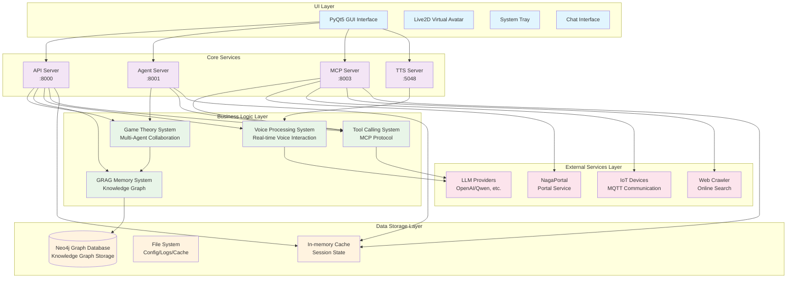
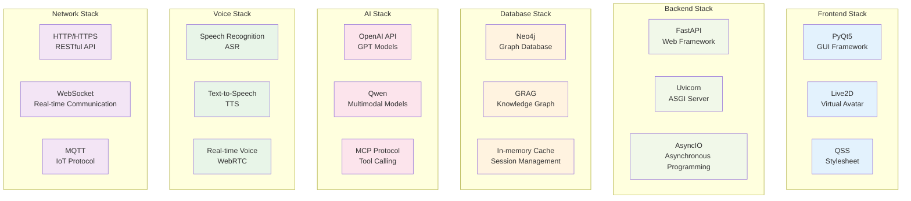

# NagaAgent

[简体中文](README.md)|[繁體中文](README_tw.md)|[English](README_en.md)


---

## [Get Tutorial Videos and One-Click Runner Package Here](https://www.pylindex.top/naga)


## Introduction

NagaAgent is a feature-rich intelligent conversational assistant system with the following special features:

### 🎯 Core Features
- **Intelligent Dialogue System**: Supports streaming conversations and tool-calling loops
- **Multi-Agent Collaboration**: Intelligent task scheduling based on game theory
- **Knowledge Graph Memory**: GRAG system supports long-term memory and intelligent retrieval
- **Full Voice Interaction**: Real-time voice input and output processing
- **Modern Interface**: PyQt5 GUI + Live2D virtual avatar
- **System Tray Integration**: Background operation and quick actions

### 🛠️ Technical Architecture

#### System Overall Architecture


#### Core Characteristics
- **Multi-Service Parallelism**: API Server (8000), Agent Server (8001), MCP Server (8003), TTS Server (5048)
- **Modular Design**: Each service runs independently and supports hot-swapping
- **Configuration-Driven**: Real-time configuration hot-reloading without restart
- **Cross-Platform Support**: Windows, macOS, Linux

### 🔧 Tech Stack

#### Tech Stack Architecture


#### Core Technologies
- **Python 3.11** + PyQt5 + FastAPI
- **Neo4j Graph Database** + GRAG Knowledge Graph
- **MCP (Model Context Protocol)** for Tool Calling
- **OpenAI-Compatible API** + Support for multiple LLM providers


---

## Deployment and Running Tutorial

### System Requirements
- Python 3.11
- Optional: `uv` tool (for faster dependency installation, without needing a specific Python version)

### Quick Start

>  If you encounter difficulties with deployment, please refer to the video tutorial or download the one-click runner package.

#### 1. Install Dependencies
##### Using the setup script

```bash
# Optional: Install uv first
pip install uv

# Use setup.py to initialize automatically
python setup.py

# Or use setup.sh (Linux/macOS)
./setup.sh

# Or use setup.bat (Windows)
setup.bat
```

The initialization script will automatically:
- Check the Python version
- Create a virtual environment
- Install required packages
- Copy the configuration file template
- Open the configuration file for editing
</details>

<details><summary>Manual Deployment</summary>

```bash
# Without uv
python -m venv .venv

# Linux/macOS
source .venv/bin/activate
# Windows
.\.venv\Scripts\activate

pip install -r requirements.txt

# With uv
uv sync
```
</details>

#### 2. Configure LLM API
Edit the `config.json` file and configure your LLM API information:
```json
{
  "api": {
    "api_key": "your_api_key",
    "base_url": "model_provider_openai_api_endpoint",
    "model": "model_name"
  }
}
```

<details><summary>Optional Configuration</summary>

#### Enable Knowledge Graph Memory

Install `neo4j` using `docker` or install `Neo4j Desktop`, then configure the Neo4j connection parameters in `config.json`:
```json
{
  "grag": {
    "enabled": true,
    "neo4j_uri": "neo4j://127.0.0.1:7687",
    "neo4j_user": "neo4j",
    "neo4j_password": "the_password_you_set_during_neo4j_installation"
  }
}
```

#### Enable Voice Output Function
```json
{
  "system": {
    "voice_enabled": true
  },
  "tts": {
    "port": 5048
  }
}
```

#### Live2D Related Configuration

```json5
  "live2d": {
    "enabled": false, // Whether to enable Live2D
    "model_path": "ui/live2d/live2d_models/characters/llny/mianfeimox/llny.model3.json", // Live2D model path
    "fallback_image": "ui/img/standby.png", // Fallback image
    "auto_switch": true, // Whether to switch automatically
    "animation_enabled": true, // Whether to enable animation
    "touch_interaction": true // Whether to enable touch interaction
  },
  ```

> For other configuration options, please refer to the comments in the file.

</details>

#### 3. Start the Application
```bash
# Using the start script
./start.sh          # Linux/macOS
start.bat           # Windows


# Or run the py file directly
# Linux/macOS
source .venv/bin/activate
# Windows
.\.venv\Scripts\activate
python main.py

# uv
uv run main.py
```


<details><summary>Troubleshooting</summary>

1.  **Incompatible Python Version**: Ensure you are using Python 3.11
2.  **Port in Use**: Check if ports 8000, 8001, 8003, and 5048 are available
3.  **Neo4j Connection Failed**: Make sure the Neo4j service is running
4.  **JSON parsing error when checking Neo4j connection**: Exit and restart the program
5.  **Unknown Errors**: Please create an issue to provide feedback

</details>

<details><summary>Environment Check</summary>

```bash
# Run system environment check
python main.py --check-env --force-check

# Quick check
python main.py --quick-check
```

</details>


## License

[NagaAgent License](LICENSE)


## Contributing

Issues and Pull Requests are welcome!

<details><summary>Build a One-Click Runner Package</summary>

```bash
python build.py
```
The built files are located in the `dist/` directory.

</details>


<div align="center">

**Thank you to all developers who have contributed to this project**

**⭐ If this project is helpful to you, please consider giving us a Star**

</div>
