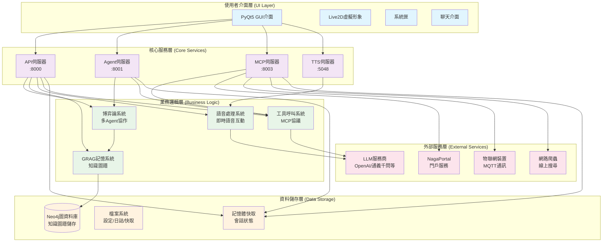
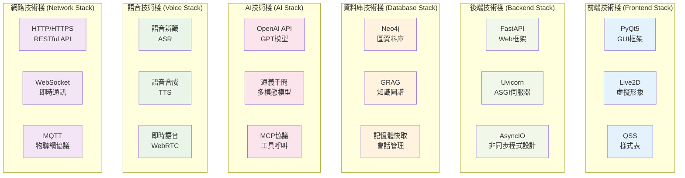

# NagaAgent

[简体中文](README.md)|[繁體中文](README_tw.md)|[English](README_en.md)


---

## [此處獲取教學影片與一鍵執行整合包](https://www.pylindex.top/naga)


## 介紹

NagaAgent 是一個功能豐富的智慧對話助理系統，具有以下特色功能：

### 🎯 核心功能
- **智慧對話系統**：支援串流對話和工具呼叫循環
- **多Agent協作**：基於博弈論的智慧任務調度
- **知識圖譜記憶**：GRAG系統支援長期記憶和智慧檢索
- **完整語音互動**：即時語音輸入輸出處理
- **現代化介面**：PyQt5 GUI + Live2D虛擬形象
- **系統匣整合**：背景執行和快捷操作

### 🛠️ 技術架構

#### 系統整體架構


#### 核心特性
- **多服務並行**：API伺服器(8000)、Agent伺服器(8001)、MCP伺服器(8003)、TTS伺服器(5048)
- **模組化設計**：各服務獨立執行，支援熱插拔
- **設定驅動**：即時設定熱更新，無需重啟
- **跨平台支援**：Windows、macOS、Linux

### 🔧 技術棧

#### 技術棧架構


#### 核心技術
- **Python 3.11** + PyQt5 + FastAPI
- **Neo4j圖資料庫** + GRAG知識圖譜
- **MCP (Model Context Protocol)** 工具呼叫
- **OpenAI相容API** + 多種LLM服務商支援


---

## 部署執行教學

### 環境要求
- Python 3.11
- 可選：uv工具（加速依賴安裝，且無需特定python版本）

### 快速開始

>  如果您的部署有困難，可以參考影片教學或下載一鍵執行整合包。

#### 1. 安裝依賴
##### 使用setup腳本

```bash
# 可選：先安裝uv
pip install uv

# 使用 setup.py 自動初始化
python setup.py

# 或使用 setup.sh (Linux/macOS)
./setup.sh

# 或使用 setup.bat (Windows)
setup.bat
```

初始化腳本會自動：
- 偵測Python版本
- 建立虛擬環境
- 安裝依賴套件
- 複製設定檔範本
- 開啟設定檔供編輯
</details>

<details><summary>手動部署</summary>

```bash
# 無uv
python -m venv .venv

# linux/Mac OS
source .venv/bin/activate
# Windows
.\.venv\Scripts\activate

pip install -r requirements.txt

# 使用uv
uv sync
```
</details>

#### 2. 設定LLM API
編輯 `config.json` 檔案，設定您的LLM API資訊：
```json
{
  "api": {
    "api_key": "你的api_key",
    "base_url": "模型服務商OPENAI API端點",
    "model": "模型名稱"
  }
}
```

<details><summary>可選設定</summary>

#### 啟用知識圖譜記憶

使用 `docker` 安裝 `neo4j` 或安裝 `neo4j desktop` 並在 `config.json` 中設定 Neo4j 連接參數：
```json
{
  "grag": {
    "enabled": true,
    "neo4j_uri": "neo4j://127.0.0.1:7687",
    "neo4j_user": "neo4j",
    "neo4j_password": "你安裝neo4j時設定的密碼"
  }
}
```

#### 啟用語音輸出功能
```json
{
  "system": {
    "voice_enabled": true
  },
  "tts": {
    "port": 5048
  }
}
```

#### Live2D 相關設定

```json5
  "live2d": {
    "enabled": false, # 是否啟用Live2D
    "model_path": "ui/live2d/live2d_models/characters/llny/mianfeimox/llny.model3.json", # Live2D模型路徑
    "fallback_image": "ui/img/standby.png", # 備用圖片
    "auto_switch": true, # 是否自動切換
    "animation_enabled": true, # 是否啟用動畫
    "touch_interaction": true # 是否啟用觸摸互動
  },
  ```

> 其他設定項可參考註解

</details>

#### 3. 啟動應用
```bash
# 使用啟動腳本
./start.sh          # Linux/macOS
start.bat           # Windows


# 或直接執行py檔案
# linux/Mac OS
source .venv/bin/activate
# Windows
.\.venv\Scripts\activate
python main.py

# uv
uv run main.py
```


<details><summary>故障排除</summary>

1. **Python 版本不相容**：確保使用Python 3.11
2. **埠被佔用**：檢查8000、8001、8003、5048埠是否可用
3. **Neo4j 連接失敗**：確保Neo4j服務正在執行
4. **偵測 Neo4j 連接時出現 json 解析錯誤**：退出並重新啟動程式
5. **未知錯誤**：請建立issue以回饋

</details>

<details><summary>環境偵測</summary>

```bash
# 執行系統環境偵測
python main.py --check-env --force-check

# 快速偵測
python main.py --quick-check
```

</details>


## 授權條款

[NagaAgent License](LICENSE)


## 貢獻

歡迎建立Issue和Pull Request！

<details><summary>建構一鍵執行整合包</summary>

```bash
python build.py
```
建構完成的檔案位於`dist/`目錄下

</details>


<div align="center">

**感謝所有開發者對本專案做出的貢獻**

**⭐ 如果這個專案對您有幫助，請考慮給我們一個 Star**

</div>
